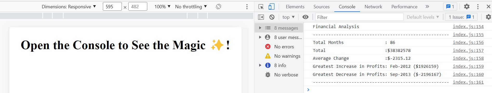

# Unit 4 Challenge: Console Finances

## Overview
 
In this challenge, we are tasked with creating code for analyzing the financial records of a company. We have been provided with a financial dataset in the `starter/index.js` file.

## Solution

1. Task01 - Evaluate total number of months in the dataset.
* Solution - I've used JS for loop to iterate through the dataset whilst incrementing the variable totalMonths.

2. Task02 - Calculate the net profit/loss earnings over the entire period
* Solution - Again, I've leveraged JS for loop and aggregated the earnings in a variable named netTotal.

3. Task03 - The average of the **changes** in Profit/Losses over the entire period.
* Solution - The task was relatively complex, so I had to break it down into multiple steps as described below:
Step01 - Leveraged map() method to create a new array with just earnings data in it for the ease of further arithmetic processing
Step02 - Used JS for loop to evaluate the month on month earning difference
Step03 - Again using for loop summed up the total change in profits
Step04 - Finally, evaluated the average of change in profilt/loss over the entire period

4. Task04 & Task05 - The greatest increase & decrease in profits (date and amount) over the entire period.
* Solution - The following steps were required to accomplish another complex task
Step01 - Created a new array based on the existing finances array and the result array from Task03 Step02
Step02 - Initialised new variables namely maxProfit & minProfit for future referencing
Step03 - Finally, using JS for loop iterated through the newData array with an condition to check for max and min profit values & the corresponding month

5. Task06 - Printed the financial analysis to the console.
* Solution 
Step01 - Combineed strings and variables in the console using concatenation.
Step02 - the Average Change value was printed to the nearest 100th using JS method toFixed(2).

* The URL of the deployed application.

* The URL of the GitHub repository.

---

## Copyright

© 2022 edX Boot Camps LLC. Confidential and Proprietary. All Rights Reserved.

